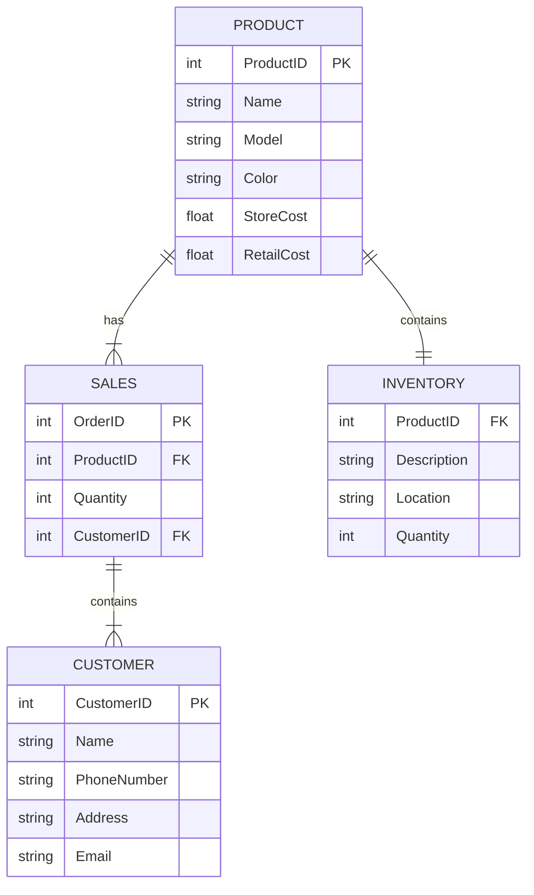

## **Nike Store ERD**

### **Documentation**
##### Show the relationships between the entities - _Product / Sales / Customer / Inventory_
There are relationships between Product and Inventory / Product and Sales / Sales and Customer
1. *Product to Inventory* - Product has a one to one relationship with Inventory. ProductID is a primary key in product and foreign key in Inventory.
2. *Product to Sales* - Product has a one to many relationship with Sales. ProductID is the primary key and a foreign key in Sales.  Sales has the primary key of OrderID. 
3. *Sales to Customer* - Sales has a one to many relationship with Customer. Customers can have multiple purchases with the store. CustomerID is a primary key in customer and a foreign key in Sales.
##### Relationship Significance
1. *Product to Inventory* - The one to one relationship of Product to Inventory shows that there is only one ProductID and it only has one inventory location. The Product entity gives all the specifics about the shoe and the Inventory shows how many are in stock and their location. Product also shows information about the item. It gives the model, color, store cost, and retail cost. This is important to show the profit each shoe makes for the store.
2. *Product to Sales* - Product to Sales has one ProductID to many OrderID. The OrderID represents the receipt of an order. It can have multiple different ProductIDs. Sales also shows what CustomerID made the purchases. This is used to track the customer and location of sales.  
3. *Sales to Customer* - Sales to Customer is a one to many relationship. Customers can have multiple purchases at the store.  Each purchase is identified with one OrderID. Each OrderID can have multiple items purchased. Customer information such as address, email, phone number will be stored to analyze how the customers shop.    

