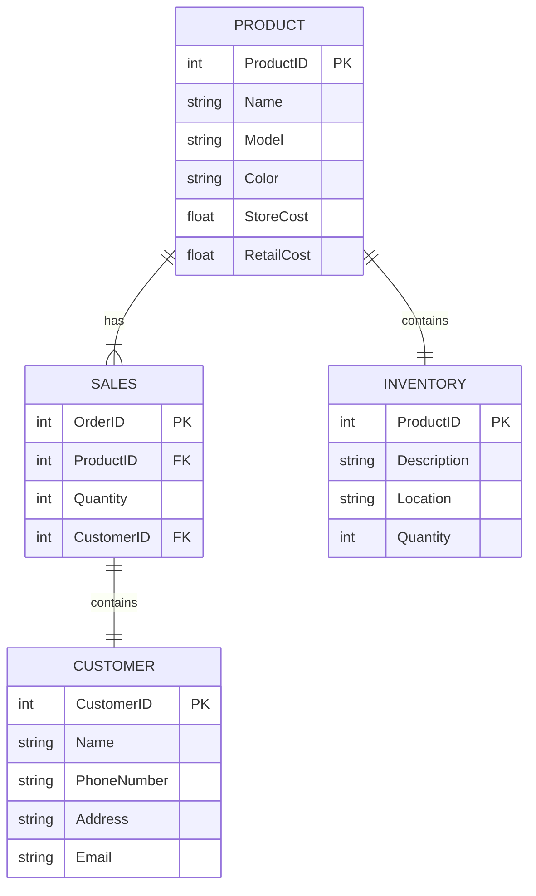

## Nike Store ERD

```mermaid
erDiagram
    PRODUCT ||--|{ SALES : has
    PRODUCT {
        int ProductID PK
        string Name
        string Model
        string Color
        float StoreCost
        float RetailCost
    }
    SALES {
        int OrderID PK
        int ProductID FK
        int Quantity
        int CustomerID FK    
   }
    SALES ||--|| CUSTOMER : contains
        CUSTOMER {
        int CustomerID PK
        string Name
        string PhoneNumber
        string Address
        string Email
    }
    PRODUCT ||--|| INVENTORY : contains
    INVENTORY {
        int ProductID PK
        string Description
        string Location
        int Quantity
    }

```

