## Nike Store ERD

```mermaid
erDiagram
    PRODUCT ||--|{ SALES : has
    PRODUCT {
        int ProductID PK
        string Name
        string Model
        string Color
        float StoreCost
        float RetailCost
    }
    SALES {
        int OrderID PK
        int ProductID FK
        int Quantity
        int CustomerID FK    
   }
    SALES ||--|| CUSTOMER : contains
        CUSTOMER {
        int CustomerID PK
        string Name
        string PhoneNumber
        string Address
        string Email
    }
    PRODUCT ||--|| INVENTORY : contains
    INVENTORY {
        int ProductID FK
        string Description
        string Location
        int Quantity
    }
```

### **Documentation**
#### Show the relationships between the entities - _Product / Sales / Customer / Inventory_
##### There are relationships between Product and Sales / Sales and Customer / Product and Inventory
1. Product to Sales. Product has a one to many relationship with Sales. ProductID is the primary key and a foreign key in Sales.  Sales has the primary key of OrderID.
2. Sales to Customer. Sales has a one to one relationship with Customer. CustomerID is a primary key in customer and a foreign key in Sales.
3. Product to Inventory. Product has a one to one relationship with Inventory. ProductID is a primary key in product and foreign key in Inventory.
##### Relationship Significance, how does it support business processes

